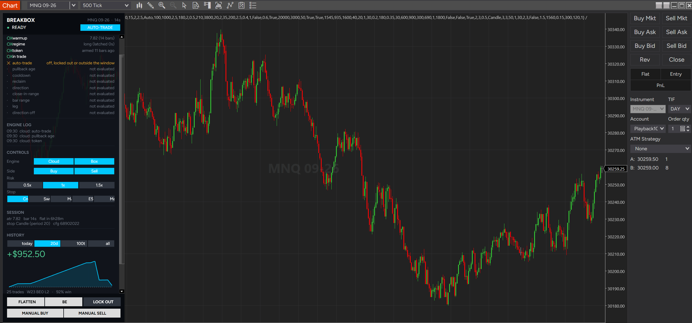
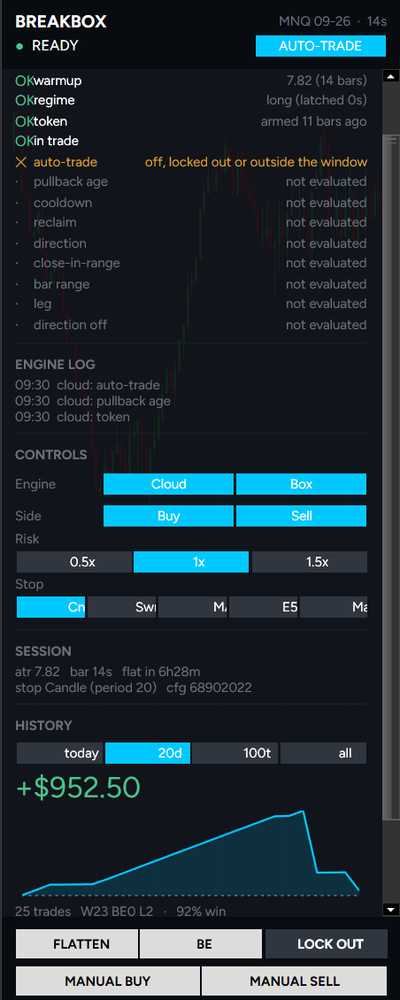
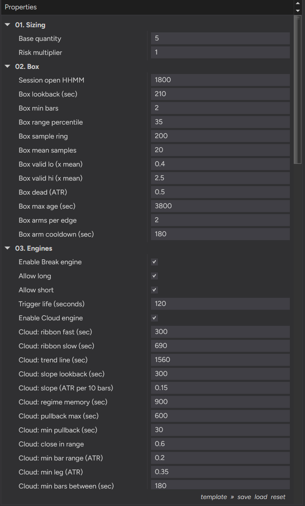
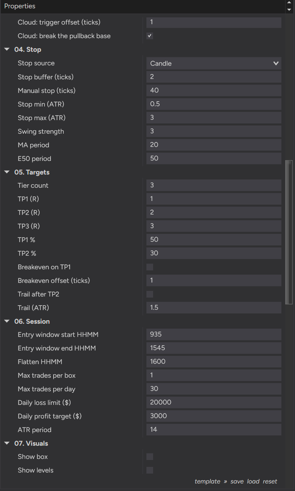
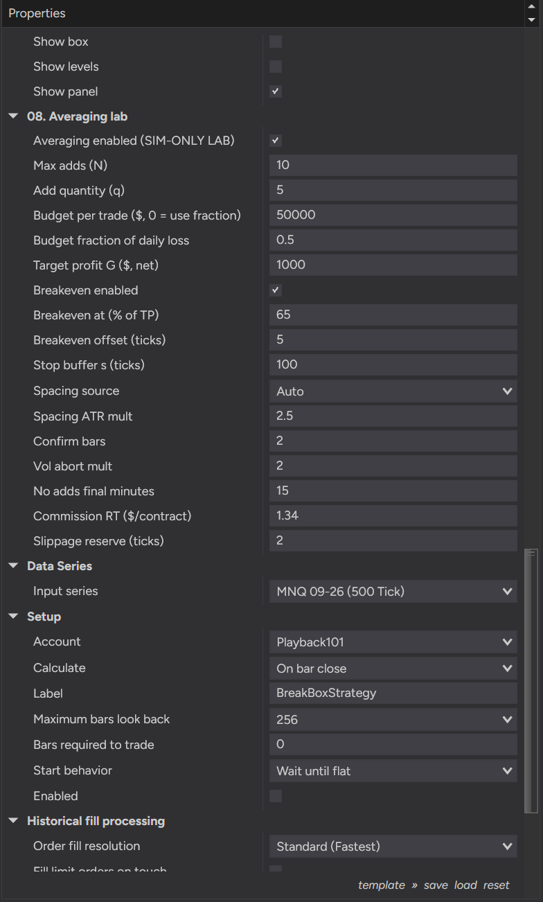

<h1 align="center">BreakBox</h1>

<p align="center">
  <b>A NinjaTrader 8 auto-trading strategy with an on-chart control panel that tells you, in plain words, why it is not taking a trade right now.</b>
</p>

<p align="center">
  
  
  
  
  
</p>



---

> ### Read this before anything else
>
> **BreakBox has no measured edge.** In the last validation pass its box engine
> measured **no edge across 439 sessions**. Nothing in this repository has been
> forward-tested to a standard that would justify risking money on it. It is
> published as an engineering artifact — a complete, honestly-instrumented NT8
> execution shell — and not as a profitable system.
>
> Futures trading carries substantial risk of loss. Run this in Simulation or
> Market Replay. If you put it on a funded or live account, that is your
> decision and your money.

---

## Table of contents

- [What this actually is](#what-this-actually-is)
- [Requirements](#requirements)
- [Install](#install)
- [Quick start](#quick-start)
- [The control panel](#the-control-panel)
- [How it decides](#how-it-decides)
- [Parameter reference](#parameter-reference)
  - [01. Sizing](#01-sizing)
  - [02. Box](#02-box)
  - [03. Engines](#03-engines)
  - [04. Stop](#04-stop)
  - [05. Targets](#05-targets)
  - [06. Session](#06-session)
  - [07. Visuals](#07-visuals)
  - [08. Averaging lab](#08-averaging-lab-sim-only)
- [Bonus: the MNQ prop-evaluation setup](#bonus-the-mnq-prop-evaluation-setup)
- [Build and test](#build-and-test)
- [Status and limits](#status-and-limits)
- [License](#license)

---

## What this actually is

Three things, and it is worth being precise about which one you came for.

**1. An execution shell.** Session windows, a timed flatten, a daily governor,
a structural stop with five selectable sources, up to three R-multiple
take-profit tiers, breakeven, a chandelier trail, and an order layer written
around the fact that NT8 — Playback especially — can deliver
`OnExecutionUpdate` *synchronously, in-stack, before the `Enter*` call that
caused it returns*. Most of the hard-won code in this repo is that shell, not
the signal.

**2. Two entry engines.** A *cloud* engine (EMA-ribbon regime + pullback +
reclaim) and a *box* engine (micro-accumulation range break). Both feed one
position; the cloud is evaluated first and the first one to fire wins the bar.

**3. An averaging-down laboratory** that refuses to arm on a live account, by
construction. It exists to **measure** whether confirmation-gated averaging
beats the null of EV = 0. It does not assume it does. See
[08. Averaging lab](#08-averaging-lab-sim-only).

All the decision logic lives in pure C# files with zero `using NinjaTrader.*`
(`BreakBoxCore.cs`, `BreakBoxCloud.cs`, `BreakBoxExits.cs`, `BreakBoxTypes.cs`,
`AveragingEngineCore.cs`). The same files compile inside NT8's Custom assembly
and inside a plain .NET test runner, so **618 assertions** pin the behaviour
without NinjaTrader being open.

## Requirements

| | |
|---|---|
| **Platform** | NinjaTrader 8 (8.1.x) |
| **Instrument** | Built and measured on NQ / MNQ. Nothing is hard-coded to it — every horizon is in seconds and every threshold is dimensionless — but no other instrument has been looked at. |
| **Session template** | The instrument's **FULL ETH** template, not an RTH one. The box is built from overnight periods; on an RTH template the 18:00-and-later slots never form. |
| **NT8 time zone** | **US Eastern.** Every `HHMM` parameter is ET wall clock. |
| **Data series** | One series. There is no `AddDataSeries` anywhere — the higher-timeframe box is folded from the primary series. |
| **Bar type** | See the note below. |

### A note on bar type

The file header asks for a **1-Minute** primary series, and that is the series
every gate was originally measured on. In practice the design scales itself:
**every horizon in the parameter surface is expressed in seconds**, and
`BbScale` converts seconds to bars using the actual bar size. On a non-time
series (tick, range, Renko) it *estimates* the bar size from history gaps and
prints a loud warning that every seconds-based horizon now inherits that
approximation.

The setup shipped at the bottom of this README runs on a **500-tick MNQ**
series, where the panel measures ~14 s per bar. That works, and it is a
deliberate deviation, not an accident — but if you want the model as it was
measured, use 1-Minute.

## Install

There is no installer and no DLL. NinjaScript source only.

1. **Download** this repository (green *Code* button → *Download ZIP*, or
   `git clone https://github.com/jalv92/BreakBox.git`).

2. **Copy the source files** into your NinjaTrader Custom folder — the path is
   `Documents\NinjaTrader 8\bin\Custom\`:

   | From `ninjascript/` | To |
   |---|---|
   | `BreakBoxStrategy.cs` | `bin\Custom\Strategies\` |
   | `BreakBoxPanel.cs` | `bin\Custom\Strategies\` |
   | `BreakBoxTypes.cs` | `bin\Custom\Strategies\` |
   | `BreakBoxCore.cs` | `bin\Custom\Strategies\` |
   | `BreakBoxCloud.cs` | `bin\Custom\Strategies\` |
   | `BreakBoxExits.cs` | `bin\Custom\Strategies\` |
   | `BreakBoxHistory.cs` | `bin\Custom\Strategies\` |
   | `AveragingEngineCore.cs` | `bin\Custom\Strategies\` |
   | `BreakBoxVision.cs` | `bin\Custom\Indicators\` |

   > The folder is decided by the file's `namespace`, not by what the file
   > "is". `BreakBoxVision.cs` is `NinjaTrader.NinjaScript.Indicators`, so it
   > goes to `Indicators\`. Everything else is a strategy or a plain helper
   > namespace and goes to `Strategies\`.
   >
   > Do not let the same file name exist in both folders. NT8 compiles one
   > assembly and you will get duplicate-type errors.

3. **Compile.** Open NinjaTrader → *New* → *NinjaScript Editor* → press **F5**.
   You should get a clean compile. (Only `BreakBoxVision` is an indicator; NT8
   will append its own generated region to that file on first compile — that is
   normal, leave it alone.)

4. Open a chart on your instrument with the **ETH** session template, right
   click → *Strategies…*, and `BreakBoxStrategy` will be in the list.

## Quick start

The safe path, in order:

1. Put it on a **Playback (Market Replay)** or **Sim101** account first. The
   whole panel and the averaging lab are built to be exercised there.
2. Load the [MNQ setup below](#bonus-the-mnq-prop-evaluation-setup), or start
   from the shipped defaults.
3. Set **`Enabled` = True** in the strategy dialog and press OK. The panel
   appears docked to the left of the chart.
4. The panel opens with **AUTO-TRADE off**. Nothing is submitted until you
   click it. Until then every gate still evaluates and the panel still tells
   you what it would have done — that is the intended way to watch it.
5. Watch the gate ladder (next section). When you understand why it is saying
   no, turn AUTO-TRADE on.

**Warmup is not instant.** `Box mean samples` is also the cold start: nothing
trades until that many boxes have sealed. The cloud additionally needs its
slope buffer full and all three EMAs warm.

## The control panel

The panel is the point of this project. It answers one question continuously:
**why is nothing happening?**

<p align="center">
  
</p>

**The gate ladder** is evaluated top to bottom and stops at the first blocker.
Everything below the blocker reads `not evaluated`, because it genuinely was
not — this is the real evaluation order, not a summary rendered after the fact:

| Rung | Blocks when |
|---|---|
| `warmup` | ATR or the slope buffer is not full yet |
| `regime` | Close / ribbon / slope are not aligned — no direction latched |
| `token` | No physical touch of the far cloud edge yet, so nothing is armed |
| `in trade` | A position is already open — one position across both engines |
| `auto-trade` | AUTO-TRADE is off, the day is locked out, or you are outside the entry window |
| `pullback age` | The pullback is younger than `Cloud: min pullback` or older than `Cloud: pullback max` |
| `cooldown` | `Cloud: min bars between` has not elapsed since the last entry |
| `reclaim` | Price has not closed back through the fast ribbon |
| `direction` | The reclaim is against the latched regime |
| `close-in-range` | The signal bar closed too far from its extreme |
| `bar range` | The signal bar is smaller than `Cloud: min bar range (ATR)` |
| `leg` | The move off the pullback extreme is shorter than `Cloud: min leg (ATR)` |
| `direction off` | `Allow long` / `Allow short` (the panel's Buy/Sell toggles) forbid this side |

**ENGINE LOG** keeps the last few refusals with timestamps, so a gate that
blinked while you were looking away is still there.

**CONTROLS** — `Engine` toggles Cloud/Box live, `Side` toggles long/short,
`Risk` multiplies position size (0.5x / 1x / 1.5x) and `Stop` switches the stop
source, all without re-opening the properties dialog.

**SESSION** shows the live ATR, the measured bar size, the countdown to the
timed flatten, the active stop source, and `cfg` — a hash of the whole
parameter set. **Two runs with different `cfg` values are different
experiments.** It is written into the trade journal for exactly that reason.

**HISTORY** plots realised P&L over today / 20 days / last 100 trades / all,
read from a journal on disk (`<UserDataDir>\BreakBox\`), so it survives a
restart.

**FLATTEN / BE / LOCK OUT** are manual overrides. `LOCK OUT` means *take no new
trades*; it deliberately does **not** close a position you chose to keep.
`MANUAL BUY` / `MANUAL SELL` open a trade with the full bracket attached.

## How it decides

### The cloud engine (primary)

Three EMAs form a ribbon: **fast**, **slow**, and a slower **trend line**.

1. **Regime** latches long or short when close, ribbon order and ribbon slope
   all agree. The latch outlives a momentarily flat reading by
   `Cloud: regime memory`; a close through the trend line *against* the regime
   kills it immediately.
2. **A token is minted** by a *physical touch* of the **far** ribbon edge —
   the slow EMA. This is the throttle, and it is the answer to "why doesn't it
   fire every bar in a trend": a runaway that never comes back to the slow EMA
   produces exactly **one** trade.
3. **The reclaim** is a bar that closes back through the fast ribbon in the
   direction of the regime, and passes the quality gates (close-in-range, bar
   range, leg length).
4. **The entry** is a stop-market order placed beyond the pullback base (or
   beyond the reclaim bar's own extreme, if `Cloud: break the pullback base` is
   off), offset by `Cloud: trigger offset`. It lives for `Trigger life` seconds
   and is then cancelled.

### The box engine (secondary)

A box is a **micro accumulation measured in bars all the way down**: the range
of the last `Box lookback` closed bars, judged against a percentile of that same
measurement over the recent past, then validated against the mean range of boxes
that sealed before it. Every number in the chain is a bar range over a bar range
— **dimensionless**, so it survives a change of bar size. A break of a sealed
box arms a stop entry beyond the edge.

The formation window **excludes the bar being processed**. Including it would be
a one-bar lookahead that lets the range see the break it is about to be tested
against.

### The bracket

Priced **at the fill**, never a bar later.

- **The stop is structural, then clamped.** Structure first (last candle, swing,
  MA, E50 or a manual tick offset), then bounded into
  `[Stop min (ATR), Stop max (ATR)]`. It is not an ATR stop with structure
  bolted on; it is the other way round.
- **`R` = |entry − stop|.** Every take-profit is an exact multiple of it. TP1,
  TP2 and TP3 are three independent dials, not a doubling rule.
- **One stop covering the open quantity**, plus one limit per live tier. There
  is deliberately **no** `SetStopLoss` / `SetProfitTarget` / `SetTrailStop`
  anywhere: the managed approach ignores `Exit*` while a `Set*` is active, which
  silently reverts a bracket you dragged by hand.
- **Drag the stop in Chart Trader and it survives** — it is adopted at the new
  price or re-covered, never left unprotected.

### The daily governor

`Daily loss limit` and `Daily profit target` are checked on **every bar close**,
over realised P&L **plus the open position**. A breach locks the day out *and
flattens what is open on that bar*. Granularity is one bar — the same
granularity the whole exit stack runs at.

**Account-wide (all markets).** Turn on `Account-wide daily P&L` and every
BreakBox instance on that account — NQ, ES, CL, whatever is loaded — pools its
day P&L into one number and all of them are judged against **that**. Two charts
each up $400 hit a $750 target that neither reaches alone: the first one to see
it broadcasts the breach, and the rest flatten and lock out on their own next
bar. An instance with its own limits set to `0` still contributes to the pool
and still obeys the broadcast, so a chart you did not want limiting itself
cannot silently leave the group.

Each instance pools **its own** realised + open P&L, never the account
aggregates. `Account.Get(Realized)` and `Get(Unrealized)` are two separately
updated numbers: the instant a winner's target fills, realised is already
credited while account unrealised still carries the closed position, and the sum
double-counts that trade. LatigoBreak hit exactly that live on 2026-08-10 — a
$750 target flattened everything at $539 realised.

Two limits: the pool lives inside **one NinjaTrader process**, so it does not
span two machines; and it is keyed by account, so Sim101 and a live account
never mix. Leave it **off** in the Strategy Analyzer — backtest instances share
the same process and would pool into each other.

## Parameter reference

Every parameter, what it does, and the shipped default. `HHMM` values are US
Eastern wall clock. Every horizon is in **seconds** and is converted to bars
using the measured bar size — so the same numbers mean the same thing on a 1-min
and on a 30-sec chart.

 

### 01. Sizing

| Parameter | Default | What it does |
|---|---|---|
| **Base quantity** | 3 | Contracts per entry, before the risk multiplier. |
| **Risk multiplier** | 1.0 | Scales base quantity. The panel's `0.5x / 1x / 1.5x` buttons write this live. |

### 02. Box

| Parameter | Default | What it does |
|---|---|---|
| **Session open HHMM** | 1800 | Start of the trading day. An 18:30 bar belongs to the *next* calendar day's session — get this wrong and the daily trade budget silently halves on some days and doubles on others. |
| **Box lookback (sec)** | 210 | Length of the range being measured. 210 s = 7 bars at 30 s. |
| **Box min bars** | 2 | Consecutive passing bars before a box seals. |
| **Box range percentile** | 35 | A candidate must be tighter than this percentile of recent ranges. Lower = only the quietest accumulations qualify. |
| **Box sample ring** | 200 | How many recent range measurements the percentile is computed over. |
| **Box mean samples** | 20 | How many *sealed* boxes form the validity mean. **Also the cold start — nothing trades until this many boxes have sealed.** |
| **Box valid lo (× mean)** | 0.4 | Reject a box smaller than this multiple of the mean box. |
| **Box valid hi (× mean)** | 2.5 | Reject a box larger than this multiple of the mean box. |
| **Box dead (ATR)** | 0.5 | A box thinner than this fraction of ATR is noise, not accumulation. |
| **Box max age (sec)** | 1800 | A sealed box expires after this. |
| **Box arms per edge** | 2 | How many times one edge may arm an entry before that edge is done. |
| **Box arm cooldown (sec)** | 180 | Minimum gap between two arms from the same box. |

### 03. Engines

| Parameter | Default | What it does |
|---|---|---|
| **Enable Break engine** | ✔ | The box engine. |
| **Allow long** / **Allow short** | ✔ / ✔ | Direction filter, applies to both engines. The panel's Buy/Sell toggles write these. |
| **Trigger life (seconds)** | 120 | How long a working entry order rests before it is cancelled. |
| **Enable Cloud engine** | ✔ | The primary engine. |
| **Cloud: ribbon fast (sec)** | 300 | Fast EMA. 300 s = EMA(10) at 30 s. The **reclaim** is measured against this edge. |
| **Cloud: ribbon slow (sec)** | 690 | Slow EMA = the **far** edge. A physical touch of *this* line is what mints the token. |
| **Cloud: trend line (sec)** | 1560 | The regime backstop. A close through it against the regime kills the regime and the token. |
| **Cloud: slope lookback (sec)** | 300 | Window the ribbon slope is measured over. Useful search range 150–600. |
| **Cloud: slope (ATR per 10 bars)** | 0.15 | Minimum ribbon slope for a regime to latch, normalised by ATR. Search 0.05–0.40. |
| **Cloud: regime memory (sec)** | 900 | How long the regime latch outlives a momentarily flat instantaneous reading. |
| **Cloud: pullback max (sec)** | 600 | Past this the touch is old news and the token dies. |
| **Cloud: min pullback (sec)** | 30 | Floor above the touch bar. The touch bar itself can never fire. |
| **Cloud: close in range** | 0.60 | Signal bar must close in the top (long) / bottom (short) fraction of its own range. 1.00 = wickless. |
| **Cloud: min bar range (ATR)** | 0.20 | Minimum size of the signal bar. **Search 0.0–0.30 only.** |
| **Cloud: min leg (ATR)** | 0.35 | Minimum move from the pullback extreme to the signal. Search 0.20–0.80. |
| **Cloud: min bars between (sec)** | 180 | Throttles a cluster of entries inside one pullback. |
| **Cloud: trigger offset (ticks)** | 1 | How far beyond the trigger level the stop entry rests. |
| **Cloud: break the pullback base** | ✔ | **On:** entry rests beyond the ceiling of the basing action at the bottom of the pullback, armed before the impulse bar. **Off:** beyond the reclaim bar's own high — which a tall bar carries a long way with it. Two genuinely different strategies; the `cfg` hash separates them. |

### 04. Stop

| Parameter | Default | What it does |
|---|---|---|
| **Stop source** | `Candle` | Structure the stop is derived from: `Candle`, `Swing`, `MA`, `E50` or `Man`. The panel switches it live. |
| **Stop buffer (ticks)** | 2 | Padding beyond the structure. |
| **Manual stop (ticks)** | 40 | The `Man` source — and the fallback for every other source when its structure is unavailable. |
| **Stop min (ATR)** | 0.5 | Floor: a structural stop tighter than this is widened. |
| **Stop max (ATR)** | 3.0 | Ceiling: a structural stop wider than this is tightened. |
| **Swing strength** | 3 | Bars either side required for a swing pivot (`Swing` source). |
| **MA period** | 20 | Period for the `MA` source. |
| **E50 period** | 50 | Period for the `E50` source. |

### 05. Targets

| Parameter | Default | What it does |
|---|---|---|
| **Tier count** | 3 | How many take-profit tiers are live (1–3). |
| **TP1 (R)** / **TP2 (R)** / **TP3 (R)** | 0.5 / 1.0 / 1.5 | Each tier's distance as a multiple of `R = \|entry − stop\|`. Three independent dials — deliberately not "TP1 and a doubling rule". |
| **TP1 %** | 50 | Share of the position closed at TP1. |
| **TP2 %** | 30 | Share closed at TP2. The remainder runs to TP3. |
| **Breakeven on TP1** | ✔ | Move the stop to entry ± offset when TP1 fills. Inert on averaging trades — that module has its own breakeven. |
| **Breakeven offset (ticks)** | 1 | How far past entry breakeven parks, in your favour. |
| **Trail after TP2** | ✔ | Switch the runner to a chandelier trail once TP2 fills. |
| **Trail (ATR)** | 1.5 | Trail distance in ATR. Moves only at a bar close — at most one cancel-replace per bar. |

### 06. Session

| Parameter | Default | What it does |
|---|---|---|
| **Entry window start HHMM** | 930 | No new entries before this. |
| **Entry window end HHMM** | 1545 | No new entries after this. |
| **Flatten HHMM** | 1600 | Everything open is closed at this time. This is a **latch**, not a one-minute window — it keeps firing until the session open, so a thin tape with no bar closing in that minute cannot skip it. |
| **Max trades per box** | 1 | Entries allowed from one sealed box. |
| **Max trades per day** | 30 | Hard cap on entries per session. |
| **Daily loss limit ($)** | 450 | **0 = off.** Checked every bar close on realised **+ open** P&L. A breach locks the day out and flattens what is open. |
| **Daily profit target ($)** | 0 | **0 = off.** Same mechanism, other direction. |
| **Account-wide daily P&L (all markets)** | ✘ | Judge the two limits above against the **sum** of every BreakBox instance on this account instead of this chart's own P&L. See below. Leave **off** for backtests. |
| **ATR period** | 14 | Wilder ATR, hand-rolled and fed from bar closes. Everything ATR-scaled reads this. |

### 07. Visuals

| Parameter | Default | What it does |
|---|---|---|
| **Show box** | ✔ | Draw the sealed box rectangle. |
| **Show levels** | ✔ | Draw entry / stop / TP levels for the live trade. |
| **Show panel** | ✔ | The on-chart control panel. Turn it off for optimisation runs. |

### 08. Averaging lab (SIM-ONLY)

**This module refuses to arm on any account whose name does not start with
`Sim` or `Playback`.** There is no override. On an unverifiable account it fails
closed. In backtest and Market Replay it arms normally.

**Read this before you turn it on.** Averaging down cannot create edge: under a
driftless price a bounded add schedule has EV = 0. The planned loss cap is a
*mode*, not a maximum. And the payoff shape — many small wins, rare very large
losses — is the one that breaches most prop firms on **unrealised** drawdown.
This lab exists to *measure* whether confirmation-gated adds beat that null, not
to assume they do. Its product is one JSON line per armed trade in
`<UserDataDir>\BreakBox\averaging_lab_log.jsonl`, carrying the solved geometry,
every fill, the bar path, and the minimum open P&L.

**Every line carries `cfgHash`. Lines with different values are different
experiments — never pool them.**

| Parameter | Default | What it does |
|---|---|---|
| **Averaging enabled** | ✘ | Arms the lab. Module-ON is a **different strategy** from module-OFF and validates separately. |
| **Max adds (N)** | 2 | Grid depth. A dial, not a clamp: the budget still binds, so a deep grid solves to tighter spacing or refuses to arm. |
| **Add quantity (q)** | 1 | Contracts per add. |
| **Budget per trade ($)** | 0 | Direct dollar budget for one averaging trade. **0 = derive it** as `Budget fraction × Daily loss limit`. Either way it is capped by what is **left** of today's loss limit — one trade may never out-risk the day. |
| **Budget fraction of daily loss** | 0.5 | One trade's slice of `Daily loss limit`. Used only when Budget ($) = 0. |
| **Target profit G ($, net)** | 150 | Net dollar profit the whole stack exits at. Floor: `G ≥ stack × (8 ticks × tickValue − commission)`. Below the floor the trade refuses with `target_too_small_for_stack`. |
| **Breakeven enabled** | ✔ | The module's own breakeven, independent of `Breakeven on TP1`. |
| **Breakeven at (% of TP)** | 50 | Share of the distance from the **live average** to the take-profit that price must cover, measured on the bar extreme at bar close. Both ends anchor on the live average — measured from the entry, a dug grid would read negative for most of its life. |
| **Breakeven offset (ticks)** | 5 | How far beyond the live average the breakeven stop parks, in your favour, so it locks a small profit rather than scratching. Firing it **kills every remaining add level** — the rescue worked, stop rescuing. |
| **Stop buffer s (ticks)** | 8 | Below the deepest grid level. Raised to `d/2` at arm time if smaller. |
| **Spacing source** | `Auto` | `Auto` = box height when the box engine owns the trade, ATR otherwise. The budget-solved spacing caps it either way. |
| **Spacing ATR mult** | 1.0 | Structural spacing when the source resolves to ATR. |
| **Confirm bars** | 1 | Bar closes back beyond a touched level before an add fires. **Straight-line moves never confirm** — this is what stops it catching a knife. |
| **Vol abort mult** | 2.0 | One-way kill: ATR above this multiple of the entry ATR kills the remaining adds. |
| **No adds final minutes** | 15 | No arming or adding this close to `Flatten HHMM`. A dug grid meeting the timed flatten is a certain full-stack loss. |
| **Commission RT ($/contract)** | 5.76 | Round-turn commission, netted out of the budget. **The default is the NQ number — on MNQ set it to about 1.34.** |
| **Slippage reserve (ticks)** | 2 | Held back out of the budget for the full stack's stop. |

<p align="center">
  
</p>

---

## Bonus: the MNQ prop-evaluation setup

> ### ⚠️ What this configuration is for
>
> This is tuned for **one narrow purpose**: passing a funded-account evaluation
> whose rules are **end-of-day trailing drawdown** and **no daily loss limit** —
> the LucidPro 50k evaluation is the exact shape it was built against.
>
> **Do not treat it as a general-purpose configuration.** It is aggressive by
> design and it is wrong for anything else:
>
> - **`Daily loss limit` is set to $20,000, which on a 50k account means it
>   never fires.** That is deliberate — the account rule it is written for has
>   no daily loss limit, so the strategy's own limit is stood down and the
>   firm's EOD drawdown is the only governor. On a firm that *does* impose an
>   intraday loss limit, or on your own money, this number will let a day run
>   until something else stops it. **Set it to a real number.**
> - **The averaging lab is ON**, with a $50,000 per-trade budget, 10 adds of 5
>   contracts. That is a 55-contract worst case. Averaging is exactly the payoff
>   shape that breaches drawdown rules on **unrealised** P&L, which is precisely
>   why it is survivable under EOD drawdown and not under intraday.
> - **It will not do what you expect on a funded account.** The averaging module
>   refuses to arm on any account not named `Sim*` or `Playback*`. On a real
>   prop account you get the base bracket only. This configuration is what is
>   run in **Market Replay and Sim** to rehearse the evaluation.
> - **Breakeven and trail are OFF** (`Breakeven on TP1` and `Trail after TP2`),
>   so the runner goes to TP3 or to the stop. Nothing protects it in between.
>
> None of this has been validated to any statistical standard. See
> [Status and limits](#status-and-limits).

**Series:** MNQ, **500 tick**, ETH template. **Account:** Playback / Sim.
**Calculate:** On bar close. **Start behavior:** Wait until flat.
**Bars required to trade:** 0. **Maximum bars look back:** 256.

<details open>
<summary><b>01. Sizing</b></summary>

| Parameter | Value |
|---|---|
| Base quantity | `5` |
| Risk multiplier | `1` |

</details>

<details open>
<summary><b>02. Box</b></summary>

| Parameter | Value |
|---|---|
| Session open HHMM | `1800` |
| Box lookback (sec) | `210` |
| Box min bars | `2` |
| Box range percentile | `35` |
| Box sample ring | `200` |
| Box mean samples | `20` |
| Box valid lo (× mean) | `0.4` |
| Box valid hi (× mean) | `2.5` |
| Box dead (ATR) | `0.5` |
| Box max age (sec) | `3800` |
| Box arms per edge | `2` |
| Box arm cooldown (sec) | `180` |

</details>

<details open>
<summary><b>03. Engines</b></summary>

| Parameter | Value |
|---|---|
| Enable Break engine | `True` |
| Allow long | `True` |
| Allow short | `True` |
| Trigger life (seconds) | `120` |
| Enable Cloud engine | `True` |
| Cloud: ribbon fast (sec) | `300` |
| Cloud: ribbon slow (sec) | `690` |
| Cloud: trend line (sec) | `1560` |
| Cloud: slope lookback (sec) | `300` |
| Cloud: slope (ATR per 10 bars) | `0.15` |
| Cloud: regime memory (sec) | `900` |
| Cloud: pullback max (sec) | `600` |
| Cloud: min pullback (sec) | `30` |
| Cloud: close in range | `0.6` |
| Cloud: min bar range (ATR) | `0.2` |
| Cloud: min leg (ATR) | `0.35` |
| Cloud: min bars between (sec) | `180` |
| Cloud: trigger offset (ticks) | `1` |
| Cloud: break the pullback base | `True` |

</details>

<details open>
<summary><b>04. Stop</b></summary>

| Parameter | Value |
|---|---|
| Stop source | `Candle` |
| Stop buffer (ticks) | `2` |
| Manual stop (ticks) | `40` |
| Stop min (ATR) | `0.5` |
| Stop max (ATR) | `3` |
| Swing strength | `3` |
| MA period | `20` |
| E50 period | `50` |

</details>

<details open>
<summary><b>05. Targets</b></summary>

| Parameter | Value |
|---|---|
| Tier count | `3` |
| TP1 (R) | `1` |
| TP2 (R) | `2` |
| TP3 (R) | `3` |
| TP1 % | `50` |
| TP2 % | `30` |
| Breakeven on TP1 | `False` |
| Breakeven offset (ticks) | `1` |
| Trail after TP2 | `False` |
| Trail (ATR) | `1.5` |

</details>

<details open>
<summary><b>06. Session</b></summary>

| Parameter | Value |
|---|---|
| Entry window start HHMM | `935` |
| Entry window end HHMM | `1545` |
| Flatten HHMM | `1600` |
| Max trades per box | `1` |
| Max trades per day | `30` |
| **Daily loss limit ($)** | **`20000`** ← see the warning above |
| Daily profit target ($) | `3000` |
| ATR period | `14` |

</details>

<details open>
<summary><b>07. Visuals</b></summary>

| Parameter | Value |
|---|---|
| Show box | `False` |
| Show levels | `False` |
| Show panel | `True` |

</details>

<details open>
<summary><b>08. Averaging lab — SIM/Playback only</b></summary>

| Parameter | Value |
|---|---|
| Averaging enabled | `True` |
| Max adds (N) | `10` |
| Add quantity (q) | `5` |
| Budget per trade ($) | `50000` |
| Budget fraction of daily loss | `0.5` |
| Target profit G ($, net) | `1000` |
| Breakeven enabled | `True` |
| Breakeven at (% of TP) | `65` |
| Breakeven offset (ticks) | `5` |
| Stop buffer s (ticks) | `100` |
| Spacing source | `Auto` |
| Spacing ATR mult | `2.5` |
| Confirm bars | `2` |
| Vol abort mult | `2` |
| No adds final minutes | `15` |
| Commission RT ($/contract) | `1.34` |
| Slippage reserve (ticks) | `2` |

</details>

## Build and test

The decision code is pure C# and runs outside NinjaTrader:

```bash
cd tests
dotnet run
```

618 assertions covering the box, the cloud, the bracket, the averaging
geometry, arbitration between the two engines, the trade journal and the shell's
scaling. No test framework, no fixtures — a single runner that prints PASS/FAIL
per check.

`scripts/check.sh` runs the same thing.

## Status and limits

- **Core box/cloud strategy: research, unvalidated.** The box measured **no
  edge across 439 sessions** in the prior validation pass. Nothing here has
  cleared a forward test.
- **Averaging lab: sim/Playback only by construction**, gated on account name.
  It has not accrued its pre-registered sample (~680 trades), so it carries **no
  verdict** in either direction.
- **The bracket geometry** (R-multiple tiers, structural stop with an ATR clamp)
  was reverse-engineered clean-room from public screenshots of a commercial
  product — from observed behaviour and published images only, never from a
  binary and never from decompiled code. The measurement that produced it is in
  `docs/research/`.
- **No warranty of any kind.** Read the MIT licence, and re-read the box at the
  top of this file.

## License

MIT — see [LICENSE](LICENSE).

Trading futures involves substantial risk of loss and is not suitable for every
investor. Nothing in this repository is financial advice. Past or simulated
performance does not indicate future results.
